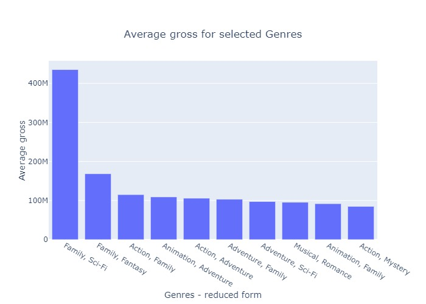
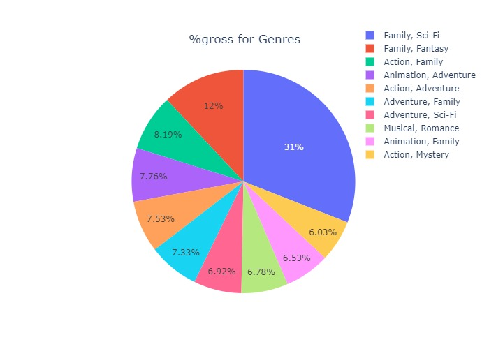
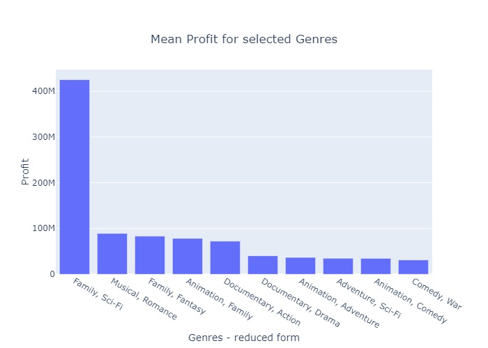
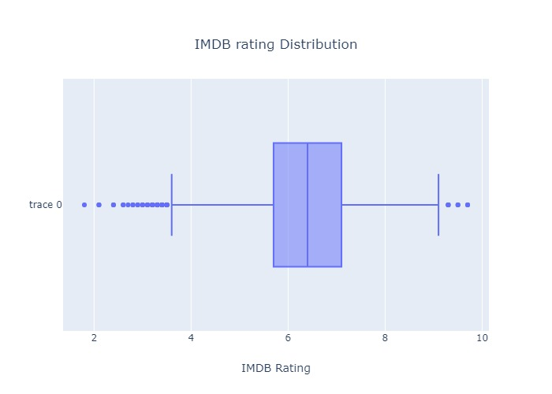
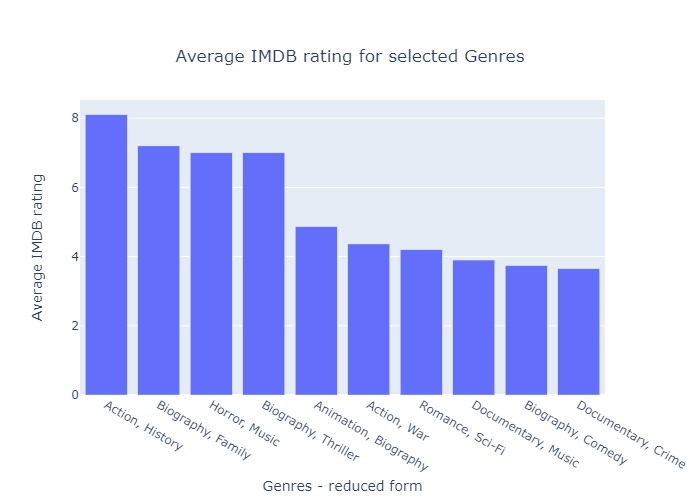

# <h1 align="center" style="font-size:300%; color:blue">What are you thinking Bill? Can I help!!! </h1>

 
<!-- >  something is hiding here <--> 
## The Project
Microsoft sees all the big companies creating original video content, and they want to get in on the fun. They have decided to create a new movie studio, but the problem is they don’t know anything about creating movies. They have hired you to help them better understand the movie industry. Your team is charged with doing data analysis and creating a presentation that explores what type of films are currently doing the best at the box office. You must then translate those findings into actionable insights that the CEO can use when deciding what type of films they should be creating.

## Data exploration
   
Initially I loaded and inspected the data files. researched where the data was originated from and what information can be obtained by the data. Here, the main data sources were the following. 
* Box Office Mojo
* IMDB
* Rotten Tomatoes
* TheMovieDB.org
Following table contain all the data files in the zipped folder. 

|      __IMDB__              |  __Box Office Mojo__   | __Rotten Tomatoes__  | __TheMovieDB.org__  |
|----------------------------|------------------------|----------------------|---------------------|
|  imdb.name.basics.csv      |  bom.movie_gross.csv   |  rt.movie_info.tsv   |   tmdb.movies.csv   |  
|  imdb.title.akas.csv       |                        |  rt.reviews.tsv      |                     |
|  imdb.title.basics.csv     |                        |                      |                     |
|  imdb.title.crew.csv       |                        |                      |                     |
|  imdb.title.principals.csv |                        |                      |                     |
|  imdb.title.ratings.csv    |                        |                      |                     |
|----------------------------|------------------------|----------------------|---------------------|
|  tn.movie_budgets.csv      |                        |                      |                     |

I carefully inspected the features to understand the data. Initial analysis suggests there are many data missing. It was apparent a thorough cleanup was necessary. The steps taken for data cleaning and scrubbing are included in the text of the Jupyter notebooks. Number of viable datapoints after cleaning was too low. After discussions with Jesse Numan one way to get missing data is to web scrape for IMDBpro.org, which is a universal repository for movie industry. He was able to device a script to obtain relatively complete dataset of over 14,428 records. I've adoped his main code and did some alterations to cater to my needs. The data was seved in "region.csv". I developed my data analysis around this much more complete dataset. The data source and alterations are mentioned in the Jupyter notebook. Staring from the scrapped dataset other information such as runtime, rating , actors and writers were grabbed from the provided datafiles.

* <b>All datafiles are located at ./Data folder in the main repo</b>

## notebook organization

1. data gathering.ipynb
This stage came about due to necessity after spending lot of time data cleaning and exploring. Thus, the files are not in chronological order but rather to what makes most sense for the project. Here, with the help of Jesse and other I’ve ventured to gather data from other sources. 

I. IMDB web API: The easiest was to use the IMDB web API to retrieve missing information via a python script. However, this method was short lived due to a rookie mistake. I forgot to add a delay to the code which resulted in getting flagged by the host. 

II. IMDBpro website: This was Jesse’s idea. The strategy was to search for a almost list of movies and scrape the relevant information. The code is in the following notebook. 

III. TMDB web API: This is difficult than the 1st as little examples exist as to how to use it. However, I was able to find some open source python frameworks (ex. tmdbsimple) that does work. Unfortunately, time constraints limited the execution of this method but the initial code samples are attached in the notebook. 

2.	Data_Cleaning_Exploration.ipynb
All the data loading, cleaning and exploration is done in this Jupyter notebook. All the necessary features that will be required for visualization and analysis is saved to movie_main.csv. The notebook is ordered such chat each files is loaded, explored and cleaned in units of code. The comments are given on each cell where it is appropriate to do so. Joining of different data frames into one single data frame is done at the end of the notebook. All sections contain subtitles that clearly explains the purpose. 
In most places where data is missing (‘NaN’) a dummy values ( -1.0 or ‘unknown’ ) is created in hopes to get the data by other means later or not to lose too many useful data. Some features such as “death year” of a director or actor is dropped entirely. 

“Binary genres” : The genre for a movie is given as one, two, three or even more primitive genres such as action, family, Sci-Fi… etc. Such situation makes the analysis quite tedious and unclear. As a crude alternative only the 1st two primitive genres are kept for those with more than two and single valued ones are kept untouched. I’ve coined the term “binary genre” for this feature to signify it contains two primitive genres. 

3.	Visualization.ipynb
All data analysis and visualizations are executed in this notebook. Here, several of the key analysis and visualizations were done. 

* Define and create reduced genres formats for ease of analysis

* Comparison of gross earnings of different binary-genres
 

* Comparison of net profit of different binary-genres
 

#* Comparison of net profit of different primitive-genres
* Analysis of IMDB rating distribution

* Comparison of IMDB ratings of different binary-genres

* Relationship of ratings to gross earnings 
* Relationship of ratings to movie budget 
* Analysis of movie runtime distribution
* Relationship of gross earnings to movie runtimes 
* Relationship of ratings to movie runtimes 
* Comparison of movie runtimes of different binary-genres
* Comparison of gross earnings of different months of the year for movies released before and after 2014
* Comparison of gross earnings of different binary-genres for movies released in summer and winter

3. presentation.pdf
  contains the non-technical presentation of 10 slides and about 9mins. The presentation shows overall findings avoiding uncecessary details about the process or minor conclusions. 
